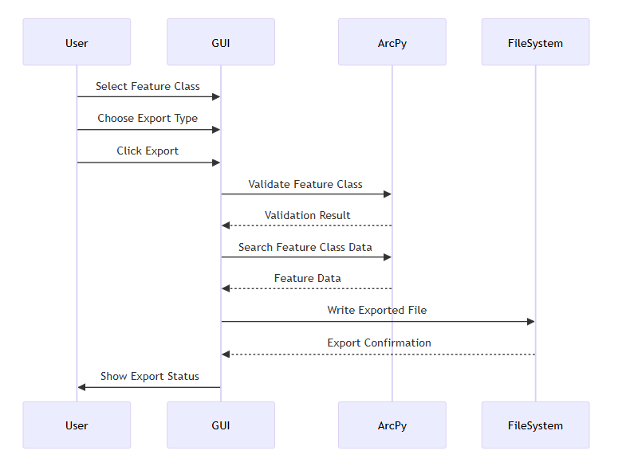

# Feature Class Export Tool

## Introduction

This tool is designed for GIS professionals and data analysts who need to quickly export feature class data from ArcGIS environments into more universally accessible formats, with a focus on ease of use and flexibility.

### Overview

This is a stand-alone tool.
This Python script is a GUI application for exporting ArcGIS feature classes to various file formats (CSV, JSON, GeoJSON) using Tkinter and ArcPy. The tool provides a user-friendly interface for selecting feature classes from SDE or geodatabase connections and exporting their data with flexible output options including geometry information.

## Latest

- `gui.py` can be used to run gui.
- `FC_Exporter_Tool_v2_0.ipynb` can be used as command line tool.

## Information

### Command Line Tool

- `FC_Exporter_Tool_v2_0.ipynb` is the command line version.

### GUI Version

- `gui.py` is the GUI version tool.

### Language

- `Python`

### Known Platform Support

- `ArcGIS Pro 3.3`
- `Geo database (.gdb)`
- `Spatial Database Engine connection (.sde)`

### Export Formats

- `csv`
- `json`
- `geoJson`

## Basic Flow Diagram

## Good To Know

- Automatically projects geometries to WGS84 (EPSG:4326) format
- Handles various spatial data sources (SDE, File Geodatabase)
- Generates timestamped filenames

## Credits

- Created by <b>Rana Muhammad Rameez</b>

## Licensing

This code and its product is free to use.
